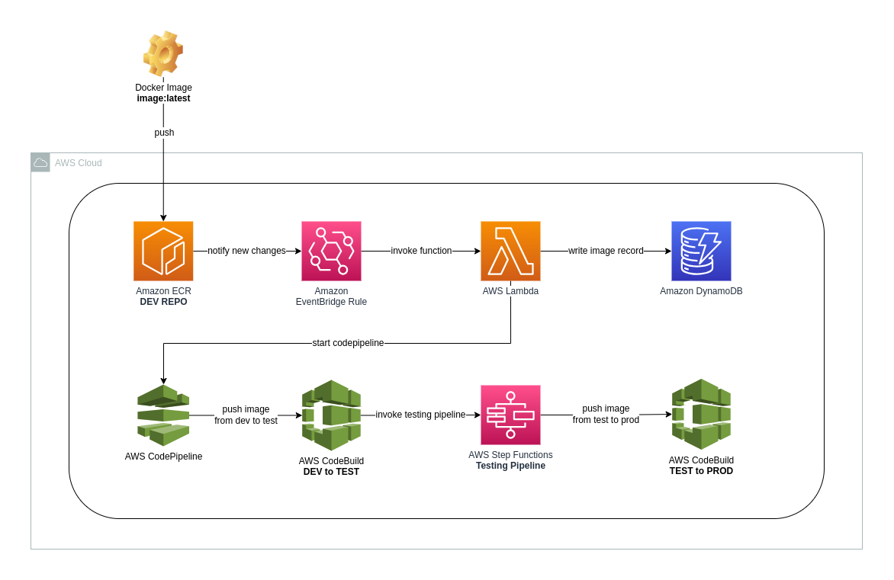

# AWS_CodePipeline-IMAGE-CICD #

## Overview ##

This is a severless Image CICD application created from AWS SAM template (AWS Cloud Formation), this project will consist of AWS serverless services and development codes that are used in the Image CICD pipeline, for instances: CodePipeline, CodeBuild project, Lambda Functions, etc.



## Table of Contents ##

- [Prerequisites](#prerequisites)
- [Building](#build)
- [Deploying](#deploy)
- [Update Image](#update)
- [Rollback Image](#rollback)
- [Elaboration](#elaboration)
- [Modifying Pipeline](#modify)
- [Usage](#usage)
- [Author](#author)

## Prerequisites <a name = "prerequisites"></a> ##

* Install AWS CLI : [installation guide](https://docs.aws.amazon.com/cli/latest/userguide/getting-started-install.html)
* AWS CLI : [installation guide](https://docs.aws.amazon.com/cli/latest/userguide/getting-started-install.html)
* AWS Account Credentials : [How to guide](https://docs.aws.amazon.com/cli/latest/userguide/cli-configure-envvars.html)
## Building <a name = "build"></a> ##

* Build the sam application.

```bash
$ sam build
```

## Deploying <a name = "deploy"></a> ##

1. When you see **Build Succeeded** from the last step, deploy the sam application to AWS cloud.

```bash
$ sam deploy
```
```bash
Deploy this changeset? [y/N]: y
```
2. As long as all resources are created, you will see the following output.

```bash
Successfully created/updated stack
```

## Update Image <a name = "update"></a> ##

1. Use the **build.sh** shell script in the target image repository to push a new version of image to DEV ECR repo.

```bash
$ ./build.sh
```
2. After pushing the image to AWS ECR, you can start monitoring the Image CICD process on AWS CodePipeline console.

## Rollback Image <a name = "rollback"></a> ##

1. Use the **rollback.sh** shell script to rollback versions in Production ECR repo.

```bash
$ ./rollback.sh
```
2. Select the ECR repo you want to rollback by entering numerical option.
```bash
Please select the ECR repo you want to rollback by entering option number:
1) ecr-prod/repo-1
2) ecr-prod/repo-2
3) ecr-prod/repo-3
4) ecr-prod/repo-4
#?
```
```
Chosen option: ecr-prod/repo-1
Confirm rollback in ecr-prod/repo-1? (y/n): y
```
3. After confirming rollback, you can see the output and results from rollback lambda function.
```
Rollback from v0.15 to v0.14
Rollback completed
```

## Elaboration <a name = "elaboration"></a> ##

**[Source Stage]**
1. The Image CICD pipeline will be automatically triggered by an EventBridge Rule if the LATEST version image in any of the following ECR repos has been updated.
    * ecr-dev/repo-1
    * ecr-dev/repo-2
    * ecr-dev/repo-3
    * ecr-dev/repo-4

**[Test Stage]**
1. Whenever the Test stage receives a new update from the Source stage, it sends a notification via SNS and waits for manual approval to proceed.
2. After receiving approval from the user, the Test stage begins building and pushing the updated image in DEV repo to TEST repo.
3. Following the success of image pushing, the Test stage invokes the test statemachine for testing the updated image in the Test repo.

**[Production Stage]**
1. After successfully proceeded all of the above tasks and tests, the Production stage sends a notification via SNS and waits for manual approval to deploy.
2. After receiving approval from the user, the Production stage begins building and pushing the updated image in Test repo to Production repo.

## Modifying Pipeline <a name = "modify"></a> ##
* ### Adding new ECR repos to Image CICD pipeline
1. Create new repos for dev, test and prod on AWS ECR respectively.
    **nomenclature**: </br>
    ecr-dev/new-repo</br>
    ecr-test/new-repo</br>
    ecr-prod/rnew-repo</br>

2. Find the **EcrEventRule** in **template.yaml** file, which defines the ECR repos that EventBridge Rule monitors.

```yml
# EcrEventRule (Partial)
EcrEventRule:
  Type: AWS::Events::Rule
  Properties:
    Description: Event rule to automatically start image-cicd-pipeline when new changes occur in ECRs.
    EventBusName: default
    EventPattern:
      source:
        - aws.ecr
      detail:
        action-type:
          - PUSH
        image-tag:
          - latest
        repository-name:
          - ecr-dev/repo-1
```
3. At the repository-name section, add new ECR **DEV** repo names.
```yml
# EcrEventRule (Partial)
        repository-name:
          - ecr-dev/repo-1
          - ecr-dev/new-repo
```
4. Add new **PROD** repos to **rollback.sh** rollback options. 
```bash
# rollback.sh (Partial)
# Define the ECR repo options
options=("ecr-prod/repo-1" "ecr-prod/new-repo")
```
```bash
# rollback.sh (Partial)
# Prompt the user to select an ECR repo
select opt in "${options[@]}"; do
    case $opt in
        "ecr-prod/repo-1")
            chosen_option="ecr-prod/repo-1"
            break
            ;;
        "ecr-prod/new-repo")
            chosen_option="ecr-prod/new-repo"
            break
            ;;
        *)
            echo "Invalid option"
            ;;
    esac
done
```
5. Build and deploy the sam application again.

```bash
$ sam build
```
```bash
$ sam deploy
Deploy this changeset? [y/N]: y
```
```bash
Successfully updated stack
```
---


* ### Modifying image-cicd-pipeline from AWS Management Console
1. This CICD application is designed to be updated and deployed from AWS CloudFormation template, please avoid modifying the application from AWS Management Console or AWS CLI.
2. If necessary, after modifying from CodePipeline Console, you will encounter below confirmation:
```
Source action changed
We will update the following resources to detect changes for your updated pipeline.
Add	| Pipeline image-cicd-pipeline as a target to Amazon CloudWatch Events rule
```
3. Please check the checkbox and ensure **No resource updates needed for this source action change** to avoid AWS automatically overrides the settings of EventBridge Rule.
```
V | No resource updates needed for this source action change
```

## Usage <a name = "elaboration"></a> ##
#### buildspec.yml
The **buildspec.yml** file specifies respective building commands in different stage to build and push images.
```bash
version: 0.2
env:
  shell: bash
phases:
  build:
    commands:
      # Pushing ECR image to TEST/PROD repo
      # ECR image Update strategy:
      # 1. Get the last numerical version number before LATEST
      # 2. Retag numerical version number to current LATEST
      # 3. Push the new image to ECR (ECR auto update LATEST tag)
      # Get current pipeline execution id from cli
      - exec_id=`aws codepipeline list-pipeline-executions --pipeline-name ${CODEPIPELINE_NAME}| jq -r '.pipelineExecutionSummaries[] | select(.status == "InProgress").pipelineExecutionId' | tail -n 1` 
      - echo "current execution id is ${exec_id}"
      # Get ECR repo name from DynamoDB
      - ecr_repo=`aws dynamodb get-item --table-name ${DYNAMODB_TABLE_NAME} --key '{"execution_id":{"S":"'${exec_id}'"}}' --query Item.ecr_repo.S --output text`
      - echo "ecr repo is ${ecr_repo}"
      - image_name=${ecr_repo#*/}
      # Login to aws ECR
      - echo "logging in to AWS ECR"
      - aws ecr get-login-password --region us-east-1 | docker login --username AWS --password-stdin aws-account.dkr.ecr.us-east-1.amazonaws.com
      - echo "done ..."
      # 1. Get the last numerical version number before LATEST
      - LAST_VERSION=`aws ecr describe-images --repository-name "ecr-${IMAGE_DES}/${image_name}" --region us-east-1 --query 'imageDetails[].[imageTags[]]' --output text | sort -V | tail -n 2`
      - LAST_VERSION=$(echo "$LAST_VERSION" | awk 'NR==1')
      - |
        if [[ $LAST_VERSION =~ [[:space:]] ]]; then
          # 3. Push the new image to ECR (ECR auto update LATEST tag)
          echo "LAST_VERSION:0.1"
          docker pull aws-account.dkr.ecr.us-east-1.amazonaws.com/ecr-${IMAGE_SRC}/${image_name}
          docker tag aws-account.dkr.ecr.us-east-1.amazonaws.com/ecr-${IMAGE_SRC}/${image_name} aws-account.dkr.ecr.us-east-1.amazonaws.com/ecr-${IMAGE_DES}/${image_name}
          docker push aws-account.dkr.ecr.us-east-1.amazonaws.com/ecr-${IMAGE_DES}/${image_name}
        else
          MAJOR_NUM="${LAST_VERSION%%.*}"
          VERSION_NUM="${LAST_VERSION#*.}"
          ((VERSION_NUM++))
          LAST_VERSION="${MAJOR_NUM}.${VERSION_NUM}"
          echo "LAST_VERSION:${LAST_VERSION}"
          # 2. Retag numerical version number to current LATEST
          echo "retagging latest image on ECR"
          MANIFEST=$(aws ecr batch-get-image --region us-east-1 --repository-name "ecr-${IMAGE_DES}/${image_name}" --image-ids imageTag=latest --output text --query images[].imageManifest)
          aws ecr put-image --region us-east-1 --repository-name "ecr-${IMAGE_DES}/${image_name}" --image-tag ${LAST_VERSION} --image-manifest "$MANIFEST"
          echo "done ..."
          # 3. Push the new image to ECR (ECR auto update LATEST tag)
          docker pull aws-account.dkr.ecr.us-east-1.amazonaws.com/ecr-${IMAGE_SRC}/${image_name}
          docker tag aws-account.dkr.ecr.us-east-1.amazonaws.com/ecr-${IMAGE_SRC}/${image_name} aws-account.dkr.ecr.us-east-1.amazonaws.com/ecr-${IMAGE_DES}/${image_name}
          docker push aws-account.dkr.ecr.us-east-1.amazonaws.com/ecr-${IMAGE_DES}/${image_name}
        fi
```

## Who do I talk to <a name = "author"></a> ##
* Jeffrey Wang (jeffrey.wanggg@gmail.com)
